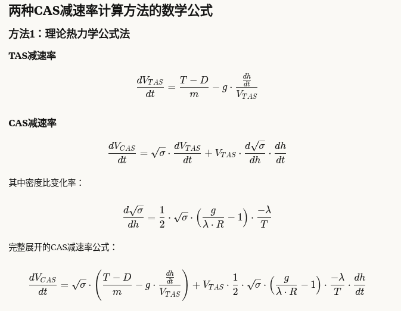

# 两种 CAS 减速率计算方法对比

## TAS 减速率计算（两方法相同）

两种方法使用了相同的 **TAS 减速率计算**，都基于基本的力学原理：

```python
term1 = net_thrust / aircraft_mass
term2 = -9.80665 * descent_rate / tas if tas > 0 else 0
tas_deceleration_ms2 = term1 + term2
```

### CAS 减速率计算（两种不同方法）
1. 理论热力学公式法

使用大气物理公式直接计算：
```python
dsigma_dh_precise = (1/2) * math.sqrt(sigma) * ((g_value/(temp_gradient * R_value)) - 1) * (-temp_gradient/temp)
cas_term1 = math.sqrt(sigma) * tas_deceleration_ms2
cas_term2 = tas * dsigma_dh_precise * descent_rate
cas_deceleration_ms2 = cas_term1 + cas_term2
```

### 2. 数值微分法（使用 pyBADA 函数）

使用 pyBADA 的转换函数进行数值微分：
```python
current_cas = atm.tas2Cas(tas, delta_val, sigma_val)
altitude_delta = 1.0  # 1 米高度差
new_alt = altitude_m - altitude_delta  # 下降
new_theta, new_delta, new_sigma = atm.atmosphereProperties(new_alt, DeltaTemp)

new_tas = tas + tas_deceleration_ms2 * 1.0  # 1 秒后的 TAS
new_cas = atm.tas2Cas(new_tas, new_delta, new_sigma)

cas_deceleration_ms2 = (new_cas - current_cas) / 1.0  # 每秒变化率

```

| 特点        | 理论公式法               | 数值微分法                  |
| --------- | ------------------- | ---------------------- |
| **准确性**   | 依赖于理论公式的精确性         | 依赖于 pyBADA 转换函数的精确性和步长 |
| **一致性**   | 可能与 pyBADA 内部模型略有差异 | 与 pyBADA 其他计算完全一致      |
| **计算效率**  | 较高（单次计算）            | 较低（多次函数调用）             |
| **实现复杂度** | 需要理解复杂的热力学关系        | 概念简单，但需小心选择步长          |

推荐选择
在与pyBADA库集成的应用中，推荐使用第二种方法(数值微分法)，因为：

确保与pyBADA库其他部分的计算一致性
直接利用pyBADA的大气模型处理边界条件和特殊情况
避免因理论简化导致的潜在误差
建议使用场景：

如果您的代码已经深度集成了pyBADA库，使用数值微分法保持一致性更好
如果计算效率是关键因素，或者您需要更透明的计算过程，使用理论公式法



### TAS和CAS减速率关系分析
两种方法确实都以TAS减速率(加速度)为基础，然后通过不同途径计算CAS减速率：


共同起点：TAS减速率计算
两种方法使用完全相同的方程计算TAS减速率：
```python
dV_TAS/dt = (T-D)/m - g·(dh/dt)/V_TAS
```
这个公式来自基本的力学原理和能量守恒定律。
##### 不同的CAS减速率计算方法
方法1：理论推导法

直接使用TAS减速率作为输入
通过理论公式计算：
```
dV_CAS/dt = √σ·dV_TAS/dt + V_TAS·(d√σ/dh)·(dh/dt)
```
这是一个基于链式法则的解析解

方法2：数值估计法

也使用TAS减速率作为输入
但是通过"模拟"一小段时间后的状态来估计：

计算当前CAS
预测Δt秒后的TAS：new_tas = tas + dV_TAS/dt × Δt
计算新高度下对应的CAS
通过差分近似导数：dV_CAS/dt ≈ (new_cas - current_cas)/Δt

主要区别总结

两种方法都依赖于先计算TAS减速率
方法1直接应用微分公式从TAS减速率推导CAS减速率
方法2通过模拟预测和数值微分来估计CAS减速率

这种共同基础解释了为什么两种方法在大多数情况下给出相似的结果，因为它们使用相同的物理模型计算基础的TAS减速率，只是从TAS减速率到CAS减速率的转换方法不同。Retry


## 等CAS飞行ESF值的反向推导过程
https://eurocontrol-bada.github.io/pybada/_modules/pyBADA/aircraft.html#Airplane.esf
 def esf(**kwargs):
        """Computes the energy share factor based on flight conditions.


反向推导的目标是：**找到使得 CAS 保持恒定 (dCAS/dt = 0) 的 ESF 值**。

---

### 推导步骤

1. **从能量平衡方程开始**  

   能量平衡方程：
   \[
   m \cdot v \cdot \frac{dv}{dt} + m \cdot g \cdot \frac{dh}{dt} = (T - D) \cdot v
   \]

2. **引入 ESF 定义**  

   ESF 定义了能量分配给高度变化的比例：
   \[
   ESF = \frac{m \cdot g \cdot \frac{dh}{dt}}{(T - D) \cdot v}
   \]

3. **考虑 CAS 与 TAS 关系**  

   从 CAS 和 TAS 的关系导出：
   \[
   \frac{dCAS}{dt} = \sqrt{\sigma} \cdot \frac{dTAS}{dt} + TAS \cdot \frac{d\sqrt{\sigma}}{dh} \cdot \frac{dh}{dt}
   \]

4. **设置目标条件 \( dCAS/dt = 0 \)**  

   当 CAS 保持恒定时：
   \[
   \sqrt{\sigma} \cdot \frac{dTAS}{dt} + TAS \cdot \frac{d\sqrt{\sigma}}{dh} \cdot \frac{dh}{dt} = 0
   \]

5. **求解 \( dTAS/dt \) 表达式**  

   \[
   \frac{dTAS}{dt} = - \frac{TAS \cdot \frac{d\sqrt{\sigma}}{dh} \cdot \frac{dh}{dt}}{\sqrt{\sigma}}
   \]

6. **代入能量平衡方程并求解 ESF**  

   将 \( dTAS/dt \) 代入能量方程并化简，得到代码中的形式：  
   \[
   ESF = \frac{1}{1 + A + B \cdot C}
   \]

---

### 公式中各部分的物理意义

- **A 项**：表示温度梯度对大气密度变化的影响  
- **B 项**：与马赫数相关的压缩性效应  
- **C 项**：马赫数效应对密度比变化的影响  

---

### 数学过程的特点

- **复杂的微分方程**  
  - 涉及偏微分方程和热力学关系  
  - 需要考虑大气模型的特性  

- **理论简化**  
  - 基于标准大气模型  
  - 假设理想气体行为  

- **不同大气层的处理**  
  - 对流层内外采用不同公式（代码中有条件判断）  

---

这种反向推导方法是飞行性能建模的核心技术，确保飞机能够按照预期的飞行模式（如等 CAS 下降）飞行，同时准确预测其性能参数。


反向推导法与减速率解析法的关系
您的洞察非常准确！从数学本质上讲，反向推导法和减速率解析法确实是同一个理论体系的两种应用方向：
本质上的一致性
两种方法基于完全相同的物理原理和数学关系：

相同的能量平衡方程
相同的大气模型
相同的CAS-TAS转换关系

方向不同

解析法(正向计算)：

输入：ESF值
输出：CAS减速率(dCAS/dt)
方向：ESF → dCAS/dt


反向推导法(反向计算)：

输入：飞行条件(高度、马赫数等)
输出：使CAS保持恒定的ESF值
方向：设定dCAS/dt = 0 → 求ESF


数学上的关系
这两个方法实际上是同一个方程的两种不同解法：

解析法解的是：给定ESF，求dCAS/dt
反向法解的是：设dCAS/dt = 0，求ESF

验证它们的一致性
最有力的验证方式是：

使用反向推导法计算出使CAS恒定的ESF值
将这个ESF值代入解析法
检查计算出的dCAS/dt是否接近零

在理论上，这个检验应该是成立的，证明两种方法是数学上一致的不同表现形式。


### 数值微分法与解析公式的区别
您指出了一个非常关键的区别！您是对的，数值微分法确实属于计算机的方法，而不是一个显式的数学公式。
三种方法的本质比较

解析公式法（理论热力学公式法）：

是一个确定的数学公式
可以直接写在纸上
不依赖计算机特定实现
例如：dCAS/dt = √σ·dTAS/dt + TAS·(d√σ/dh)·(dh/dt)


反向推导法（等CAS的ESF计算）：

也是一个确定的数学公式
通过理论推导得出
表达为：ESF = 1/(1+A+B·C)


数值微分法：

不是一个显式数学公式
是一种计算技术
依赖计算机和特定算法实现
使用形如：(f(x+Δx) - f(x))/Δx的近似


数值方法的特点

需要编程实现，无法简单用公式表达
结果取决于选择的步长大小(Δt)
可能包含数值误差
将复杂的函数atm.tas2Cas视为"黑盒"
不需要了解内部公式，只需调用函数

简单类比

解析法就像是用公式直接计算光滑曲线在某点的斜率
数值法就像是用尺子测量曲线上两个很近的点，然后计算它们之间的斜率

这就是为什么数值法不能像解析法和反向推导法那样表达为一个优雅的数学公式，它本质上是一种计算方法，依赖于计算机的实现。